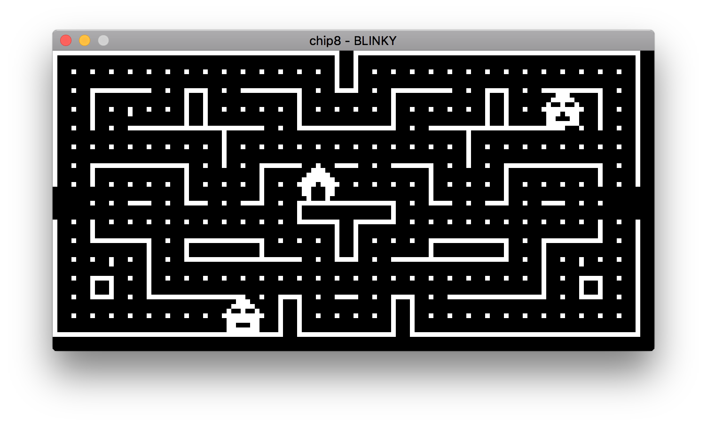
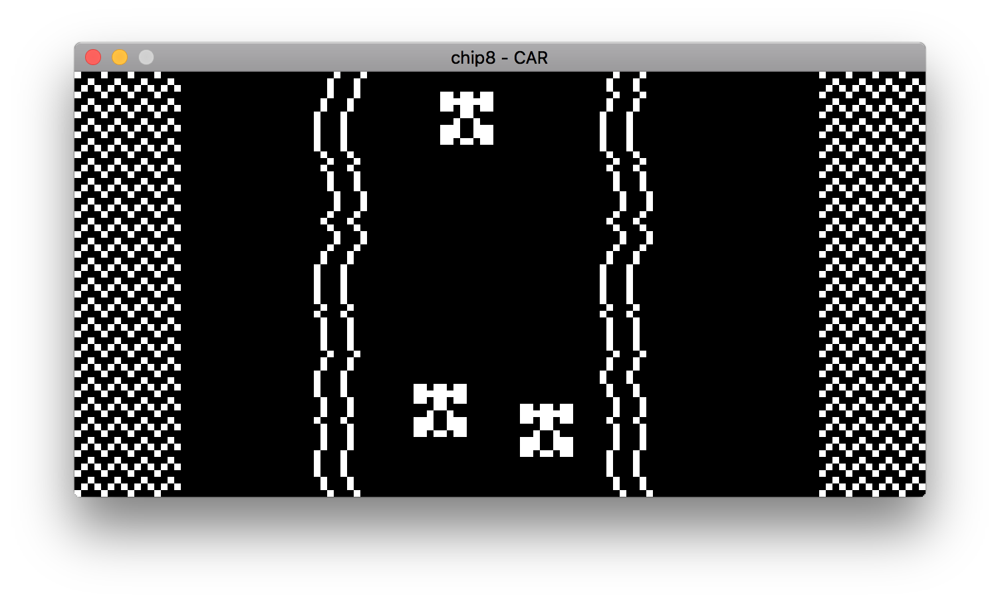
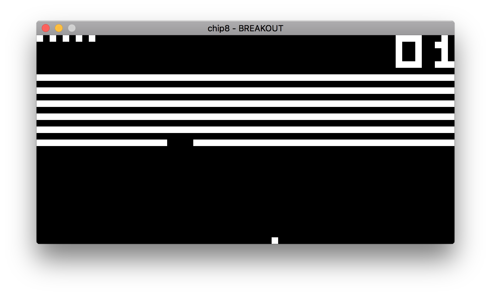

## About
A [CHIP-8/SUPER CHIP](https://en.wikipedia.org/wiki/CHIP-8) emulator library written in C. Most games should work but there might be some exceptions. Use at your own risk.

## Usage
Please see example_sdl2.c for an example SDL2 client.  

API should be quite simple and self-descriptive, here's how a theoretical client might look like:
```c
    chip8_t *ch8 = chip8_make();
    if (ch8 == NULL) {
        return;
    }

    bool ok = chip8_load_program(ch8, program, program_size);
    if (!ok) {
        return;
    }
    
    while (true) {
        chip8_keyboard_input_t input = {};
        get_input(&input);
        int num_ticks = chip8_is_super(ch8) ? 16 : 8;

        for (int i = 0; i < num_ticks; i++) {
            ok = chip8_cpu_tick(ch8, &input);
            if (!ok) {
                goto end;
            }
        }

        if (chip8_should_beep(ch8)) {
            puts("beep");
        }

        for (int y = 0; y < chip8_get_height(ch8); y++) {
            for (int x = 0; x < chip8_get_width(ch8); x++) {
                if (chip8_get_pixel(ch8, x, y)) {
                    draw_pixel(x, y);
                }
            }
        }
    }
end:
    chip8_destroy(ch8);
```

## Screenshots
  
  
  

## License
[The MIT License (MIT)](http://opensource.org/licenses/mit-license.php)